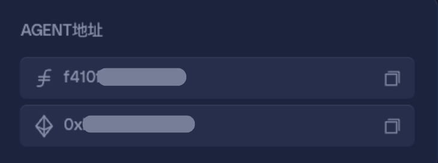
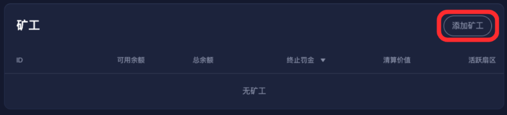
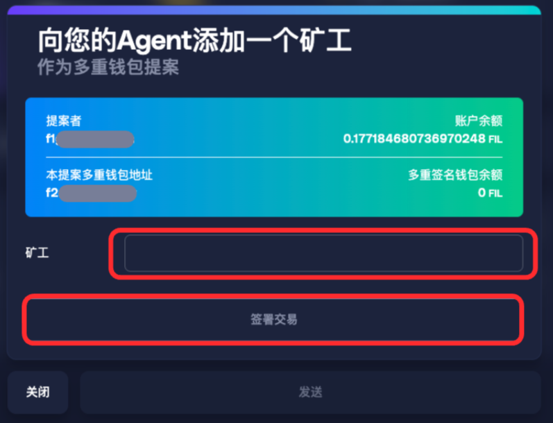
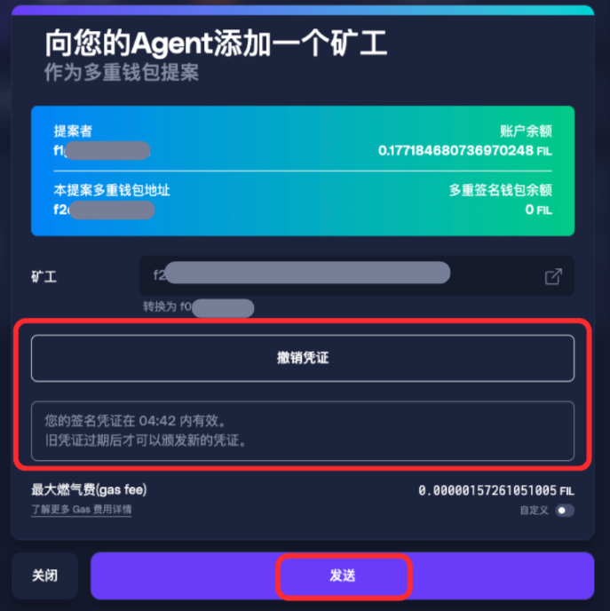
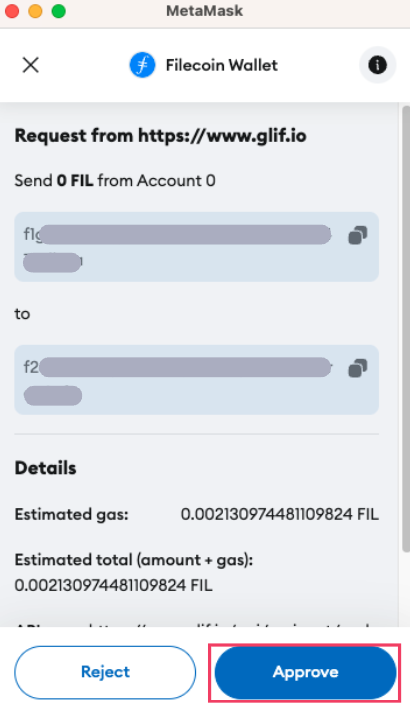
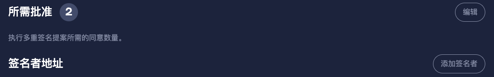
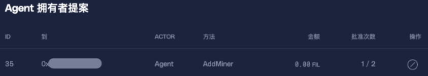
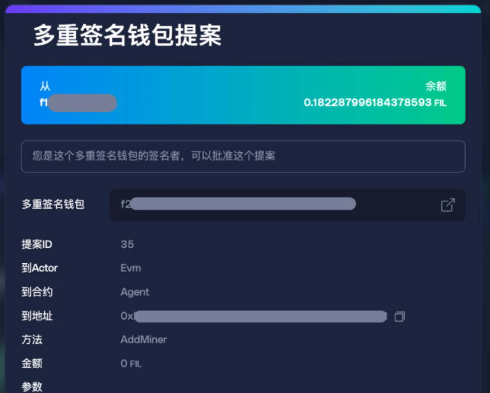
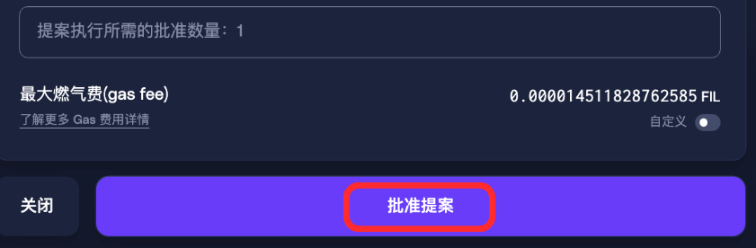
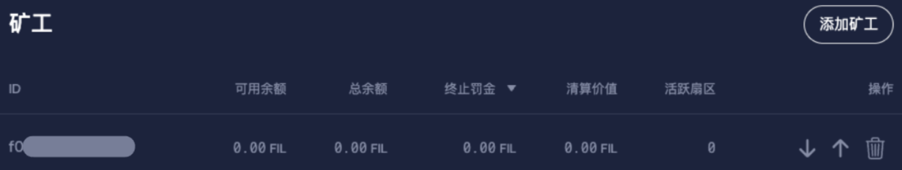

# GLIF Agent 网站教程 (3) — 添加您的矿工

_如果您还不了解 GLIF Agent 的基础概念、Agent 拥有者，或如何在 GLIF 网站上创建 Agent，建议您先阅读本系列教程的_ [_第一部分_](https://docs.glif.io/v2-zhong-wen/gu-zhang-pai-cha/cao-zuo-jiao-cheng/cao-zuo-jiao-cheng-cun-chu-ti-gong-shang/glif-agent-wang-zhan-jiao-cheng-1-zhun-bei-she-zhi) _和_ [_第二部分_](https://docs.glif.io/v2-zhong-wen/gu-zhang-pai-cha/cao-zuo-jiao-cheng/cao-zuo-jiao-cheng-cun-chu-ti-gong-shang/glif-agent-wang-zhan-jiao-cheng-2-chuang-jian-nin-de-agent)_。您可以在_[_此页面_](./)_上找到所有在 **GLIF 网站** 上使用 Agent 的教程。有关 **Agent 命令行** （CLI）操作的说明，请参考_ [_GLIF 命令行界面（CLI）文档_](https://github.com/glifio/glif?tab=readme-ov-file#agents---get-started-borrowing)_。_

***

## 开始前的准备

在本系列教程的前两部分中，您已完成以下步骤：

1. 创建了您的 Agent 拥有者多重签名钱包
2. 创建了您的 Agent 智能合约

您已成功设置了Agent，接下来的步骤是将矿工添加到您的 Agent 中。这样做可以让您的 Agent 拥有该矿工资产作为抵押品，用以从 GLIF 借出 FIL。在本教程中，我们将带您通过 GLIF 网站界面完成将矿工添加到 Agent 的过程。

***

## 第一步：提出所有权变更提案（通过 Lotus）

此步骤并不能够在 GLIF 网站或命令行内完成，具体取决于您所使用的挖矿软件。\
如果您使用的是 `lotus-miner` 命令行工具，可以执行以下命令来提出更改矿工的所有权：

`lotus-miner actor set-owner --really-do-it <agent-f410> <current-miner-owner>`

您可以在 GLIF 网站的 Agent 页面找到您的 Agent 的 `f4` 地址：

## 第二步：发起 “添加矿工” 提案 (通过GLIF网站)

1. 连接您在[第二部分](glif-agent-wang-zhan-jiao-cheng-2-chuang-jian-nin-de-agent.md)中创建的多签钱包的其中一个签名钱包。

> [!IMPORTANT]
> 当您使用拥有者钱包向 Agent 发起交易时，必须使用非 Ledger 钱包（例如 Filecoin Snap 钱包或 Burner 钱包）。\
> 您无法使用 Ledger 设备发起这些交易，Ledger 只能用于“审批者”的角色。
>
> 这项规则适用于所有 Agent 拥有者相关交易：必须由非 Ledger 签名人发起。

2. 在 Agent 页面中，进入“**矿工**”部分，点击“**添加矿工**”。

3. 在“**向您的Agent添加一个矿工**”页面中输入您的矿工地址。
4. 点击“**签署交易**”。

5. 点击“**签署交易**”后，系统会显示该凭证剩余的有效时间（分钟）。\
   若您希望撤销该凭证，可点击“**撤销凭证**”。

> [!WARNING]
> 如果您未在 **5 分钟内完成交易并使用其他签名钱包签署该提案**，则需要重新执行此步骤。

6. 点击“**发送**”以创建新的提案。您会使用当前连接的钱包签署交易。

7. 在您的钱包中批准该交易。

8. 等待交易完成，通常需要 1–2 分钟。

## 第三步：由其他签名人审批提案

您的 Agent 拥有者钱包是一个多重签名钱包，需要多个签名人共同确认重要变更。现在您已经创建了“添加矿工”的提案，接下来需要其他签名人进行审批。

1. 使用其他签名钱包登录。您可以在多签页面的“**所需批准**”部分找到所有签名钱包。这些钱包应与[第二部分](https://docs.glif.io/v2-zhong-wen/gu-zhang-pai-cha/cao-zuo-jiao-cheng/cao-zuo-jiao-cheng-cun-chu-ti-gong-shang/glif-agent-wang-zhan-jiao-cheng-2-chuang-jian-nin-de-agent)中所使用的相同。

2. 进入“**多重签名钱包**”选项。

3. 在“**Agent 拥有者提案**”中，您应能看到刚刚创建的“**AddMiner**”提案。

4. 选择您刚创建的提案。

5. 点击“**批准提案**”。

6. 在钱包中确认该交易。
7. 如果您的多签钱包需要超过两位签名人批准，请使用其他签名钱包重复相同的步骤。\
   一旦达到所需的批准数量，提案将会在链上执行。等待交易确认，这通常需要几分钟。
8. 返回 GLIF 网站的 Agent 页面。此时，您应能在“**矿工**”部分看到新添加的矿工已与您的 Agent 绑定。

***

## 恭喜！

您已成功将矿工添加到您的 Agent！

***

### 下一步：

在本系列教程的[第四部分](glif-agent-wang-zhan-jiao-cheng-4-jie-kuan.md)中，我们将向您展示如何借取FIL。

## **加入我们的社区！**

欢迎加入我们的[Discord](https://discord.gg/5qsJjsP3Re)和[Telegram](https://t.me/glifio)，或在[X](https://twitter.com/glifio)上关注我们，以获取最新消息。

如果您遇到任何困难，请随时通过我们的[Discord支持工单](https://discord.gg/5qsJjsP3Re)与我们联系。
