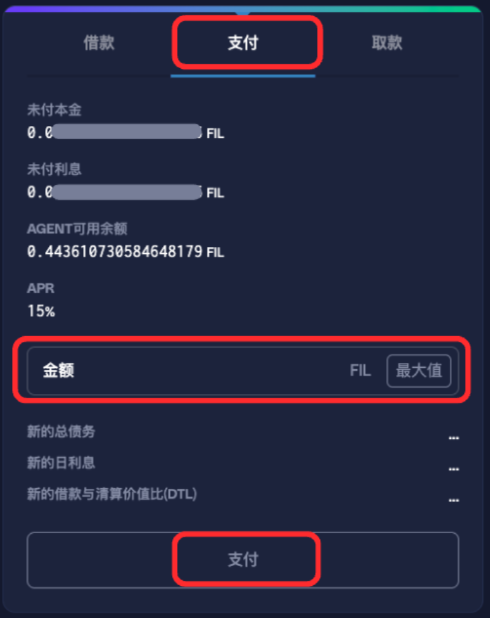
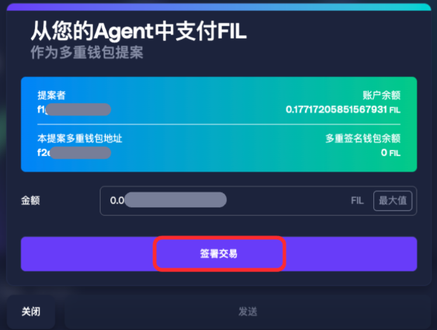
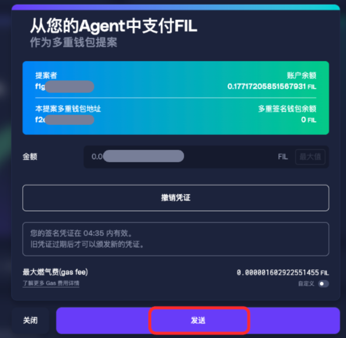
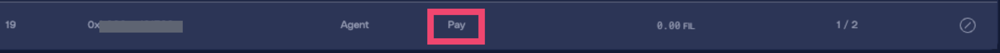
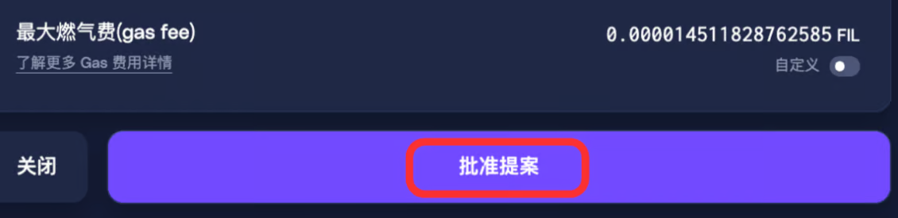
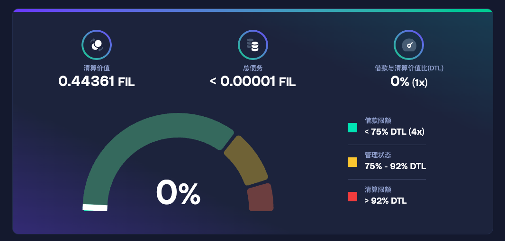

# GLIF Agent 网站教程 (8) —— 付款

_如果您还不了解 GLIF Agent 的基础概念、Agent 拥有者，或如何在 GLIF 网站上创建 Agent，建议您先阅读本系列教程的_ [_第一部分_](https://docs.glif.io/v2-zhong-wen/gu-zhang-pai-cha/cao-zuo-jiao-cheng/cao-zuo-jiao-cheng-cun-chu-ti-gong-shang/glif-agent-wang-zhan-jiao-cheng-1-zhun-bei-she-zhi) _和_ [_第二部分_](https://docs.glif.io/v2-zhong-wen/gu-zhang-pai-cha/cao-zuo-jiao-cheng/cao-zuo-jiao-cheng-cun-chu-ti-gong-shang/glif-agent-wang-zhan-jiao-cheng-2-chuang-jian-nin-de-agent)_。您可以在_[_此页面_](./)_上找到所有在 **GLIF 网站** 上使用 Agent 的教程。有关 **Agent 命令行** （CLI）操作的说明，请参考_ [_GLIF 命令行界面（CLI）文档_](https://github.com/glifio/glif?tab=readme-ov-file#agents---get-started-borrowing)_。_

***

### 开始前的准备

在本系列教程的前几部分中，您已经完成以下步骤：

1. 创建了 Agent 拥有者多重签名钱包（参见 [第一部分](https://docs.glif.io/v2-zhong-wen/gu-zhang-pai-cha/cao-zuo-jiao-cheng/cao-zuo-jiao-cheng-cun-chu-ti-gong-shang/glif-agent-wang-zhan-jiao-cheng-1-zhun-bei-she-zhi) 与 [第二部分](https://docs.glif.io/v2-zhong-wen/gu-zhang-pai-cha/cao-zuo-jiao-cheng/cao-zuo-jiao-cheng-cun-chu-ti-gong-shang/glif-agent-wang-zhan-jiao-cheng-2-chuang-jian-nin-de-agent))
2. 创建了 Agent 智能合约（参见 [第一部分](https://docs.glif.io/v2-zhong-wen/gu-zhang-pai-cha/cao-zuo-jiao-cheng/cao-zuo-jiao-cheng-cun-chu-ti-gong-shang/glif-agent-wang-zhan-jiao-cheng-1-zhun-bei-she-zhi) 与 [第二部分](https://docs.glif.io/v2-zhong-wen/gu-zhang-pai-cha/cao-zuo-jiao-cheng/cao-zuo-jiao-cheng-cun-chu-ti-gong-shang/glif-agent-wang-zhan-jiao-cheng-2-chuang-jian-nin-de-agent))
3. 已将矿工添加到 Agent 中（参见 [第三部分](https://docs.glif.io/v2-zhong-wen/gu-zhang-pai-cha/cao-zuo-jiao-cheng/cao-zuo-jiao-cheng-cun-chu-ti-gong-shang/glif-agent-wang-zhan-jiao-cheng-3-tian-jia-nin-de-kuang-gong))
4. 已从 GLIF 成功借出 FIL（参见 [第四部分](glif-agent-wang-zhan-jiao-cheng-4-jie-kuan.md)）
5. 已在矿工与 Agent 之间完成资金转移（参见 [第五部分](glif-agent-wang-zhan-jiao-cheng-5-zai-miner-he-agent-zhi-jian-zhuan-yi-fil.md)）
6. 已提取奖励或预支现金（参见 [第六部分](glif-agent-wang-zhan-jiao-cheng-6-ti-qu-jiang-li-yu-zhi-xian-jin.md)）
7. 已从 Agent 中移除矿工（参见 [第七部分](glif-agent-wang-zhan-jiao-cheng-7-cong-agent-zhong-yi-chu-kuang-gong.md)）

在完成借款后，存储提供者在完成使用借入的 FIL 后，需要偿还费用。存储提供者可以在任何时间付款，没有到期日，也不会有提前还款罚金。本教程将带您通过 GLIF 网站界面完成付款操作。

***

## 从 Agent 支付 FIL

### **第一步： 发起付款提案**

1. 在 Agent 页面右侧面板中，点击“**付款**”选项。
2. 输入要支付的金额。请确保 Agent 中有足够的余额来完成付款。
3. 点击“**支付**”。

4. 在“**从您的Agent中支付FIL**”多签提案界面中，核对细节后点击“**签署交易**”。

> [!WARNING]
> 凭证仅在 5 分钟内有效。若出现“AgentPolice: Invalid Credential”错误，表示凭证已过期，请重新开始。

5. 点击“**发送**”，并在钱包中批准交易。

6. 等待交易完成。一个“**Pay**”提案会出现在“**Agent 拥有者提案**”部分。

### 第二步： 审批**提案**

1. 使用 Agent 拥有者多签钱包中另一个签名钱包，连接GLIF网站。
2. 在“**Agent 拥有者提案**”部分找到“**Pay**”提案。
3. 点击“**批准提案**”。

4. 在钱包中确认交易。
5. 等待交易完成（约 1–2 分钟）。完成后，您将在 Agent 面板中看到总债务已减少。

***

#### **自动支付（Autopilot）**

如果您觉得手动定期付款比较麻烦，可以通过命令行（CLI）界面设置自动支付功能。请参考[此页面](https://github.com/glifio/glif?tab=readme-ov-file#autopilot)了解具体操作步骤。

> [!NOTE]
> 存储提供商借用 FIL 的时长不受限制，当借用完成后，可在任意时间归还 FIL，无需担心到期日或提前还款费用。

***

#### **退出资金池（Leave the pool）**

如果您希望永久退出资金池，只需偿还全部本金即可。有时候可能会剩余十分少量未支付的本金或利息，您可以多支付 1 FIL 以覆盖所有欠款，这样就能完全退出资金池，多付的部分将自动退回至您的 Agent。

您也可以通过命令行（CLI）使用 `glif agent exit` 来退出资金池，\
此操作将确保所有本金已偿还，不会留下任何未结算、十分少量的 attoFIL 金额。

***

### 恭喜！

您已成功向 GLIF 完成付款！

***

### 下一步

在本系列教程的[第九部分](glif-agent-wang-zhan-jiao-cheng-9-geng-gai-cao-zuo-yuan-di-zhi.md)中，我们将介绍如何修改您的**操作员地址（Operator Address）**。

## **加入我们的社区！**

欢迎加入我们的[Discord](https://discord.gg/5qsJjsP3Re)和[Telegram](https://t.me/glifio)，或在[X](https://twitter.com/glifio)上关注我们，以获取最新消息。

如果您遇到任何困难，请随时通过我们的[Discord支持工单](https://discord.gg/5qsJjsP3Re)与我们联系。
