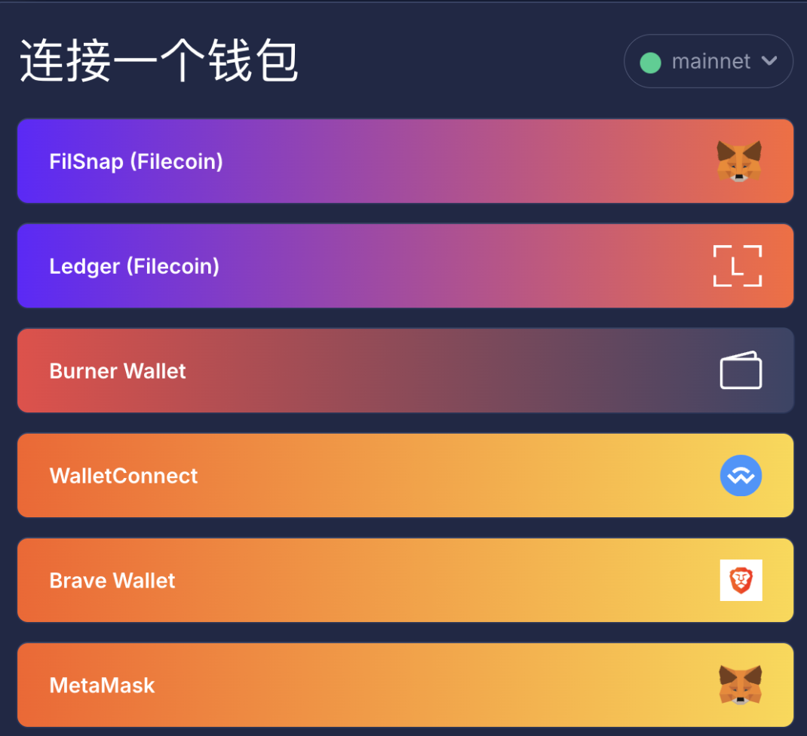
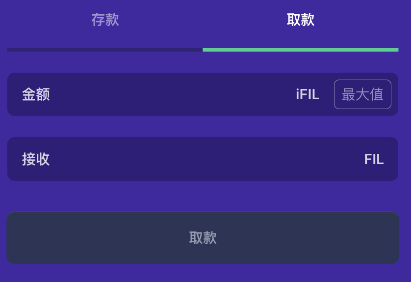
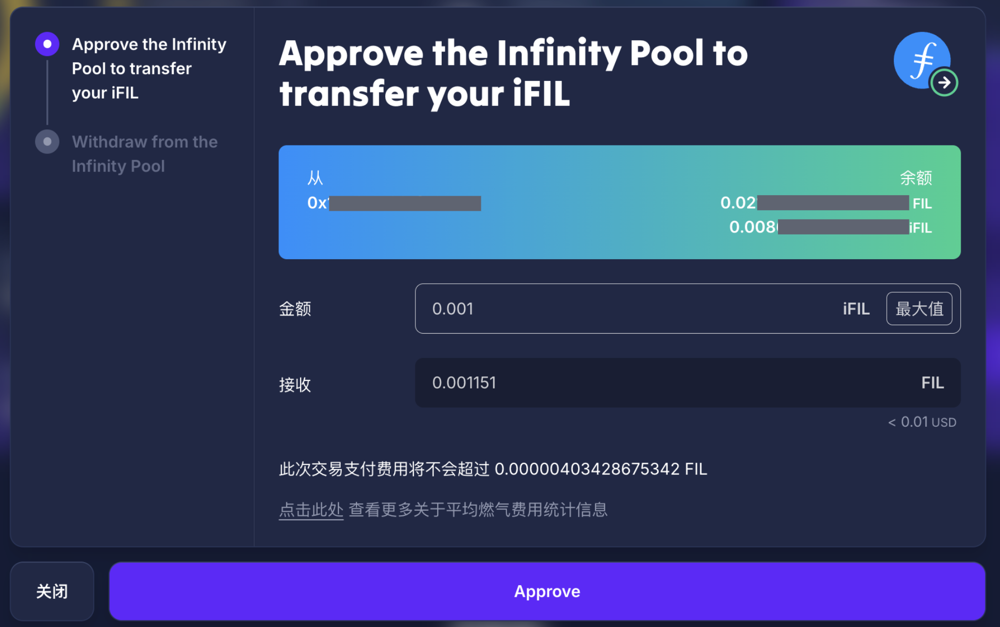
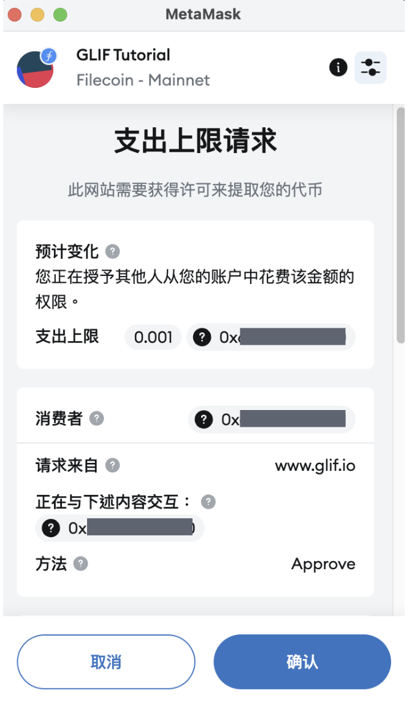
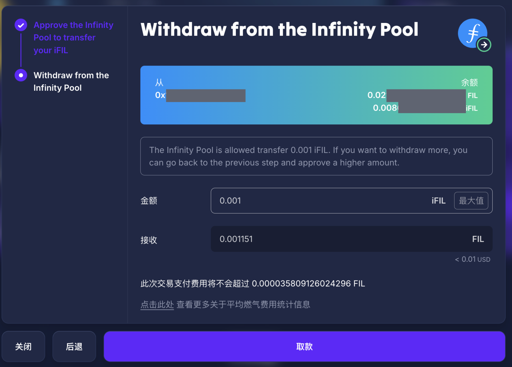
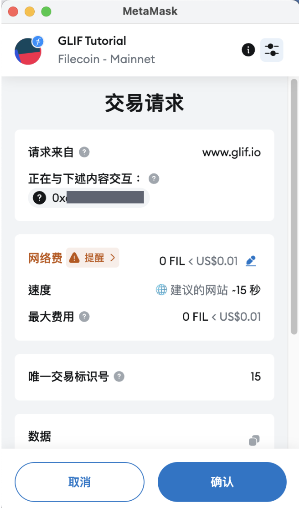
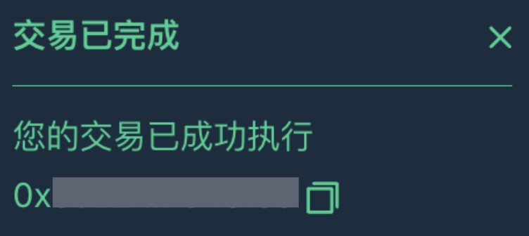
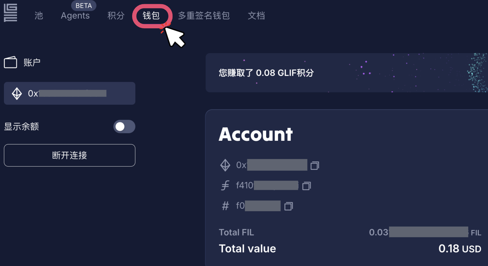

# 从 GLIF 提取 FIL

本教程将示范如何在 GLIF 用 iFIL 代币提取 FIL，而从 GLIF 提取 FIL 需要进行 2 笔交易。

> [!NOTE]
> 请[点击此处](../../../../liu-dong-xing-ti-gong-zhe/ti-qu-fil.md)，了解更多关于提取机制。

## 步骤 1：连接钱包到 GLIF

1. 访问 GLIF 网站并点击右上角的 “连接 钱包”。

2. 选择您想要连接且已拥有 FIL 的钱包。

## 步骤 2：前往 “池” 页面

1. 在 “**池**” 页面中，点击 “**取款**” 选项。
2. 输入您想要赎回的 iFIL 数量，将会显示相应可获得的 FIL 数量。请[点击此处](../../../../liu-dong-xing-ti-gong-zhe/glif-jiang-li-ji-zhi-ifil.md)了解更多关于 iFIL 的信息。
3. 点击 “**批准**”。

## 步骤 3：提交第 1 笔交易（共 2 笔）— 批准GLIF池转账

GLIF 智能合约需要获得权限，才能使用您的 iFIL 代币来处理提取要求。

1. 点击 “Approve”。

2. 点击 “确认”——请注意您可以只批准想要赎回的那部分 iFIL 数量，也可以批准 “max”，这样今后提取时就不需要重复进行该批准步骤。

## 步骤 4：提交第 2 笔交易（共 2 笔）— 提取 FIL

1. 稍等片刻（大约 1 ～ 2 分钟），您会看到交易成功的通知。在批准交易成功后，您就可以进行提取操作，点击 “**取款**”。

2. 在 MetaMask 中点击 “**確認**”。

3. 等待片刻，您会在右下角看到交易完成的提示。提取成功！

## 步骤 5：查看您的 FIL 余额

1. 在提取 FIL 后，您的钱包将增加相应数量的 FIL 。如需查看更详细的持仓信息，请点击 GLIF 左上方的 “**钱包**”。
2. 您可以在 “Account” 标签下查看钱包中的 FIL 和 iFIL 余额。

## 结论

恭喜您成功从 GLIF 提取了 FIL！

## **加入我们的社区！**

欢迎加入我们的[Discord](https://discord.gg/5qsJjsP3Re)和[Telegram](https://t.me/glifio)，或在[X](https://twitter.com/glifio)上关注我们，以获取最新消息。

如果您遇到任何困难，请随时通过我们的[Discord支持工单](https://discord.gg/5qsJjsP3Re)与我们联系。
