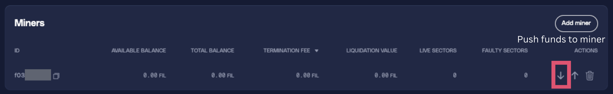
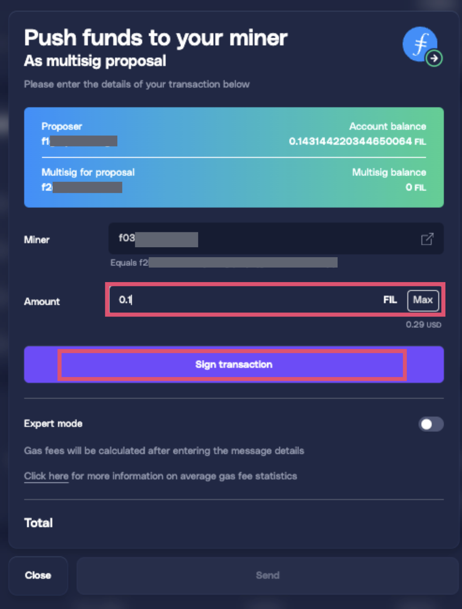
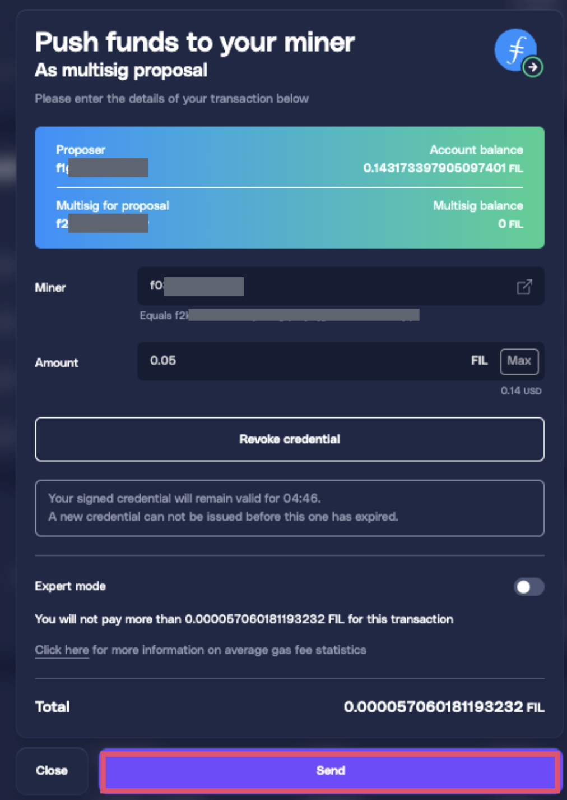
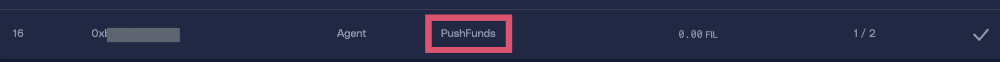
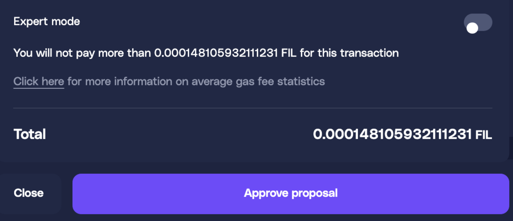
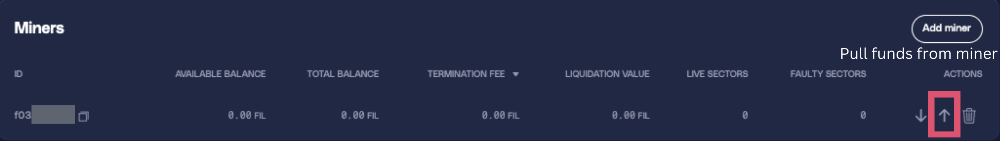
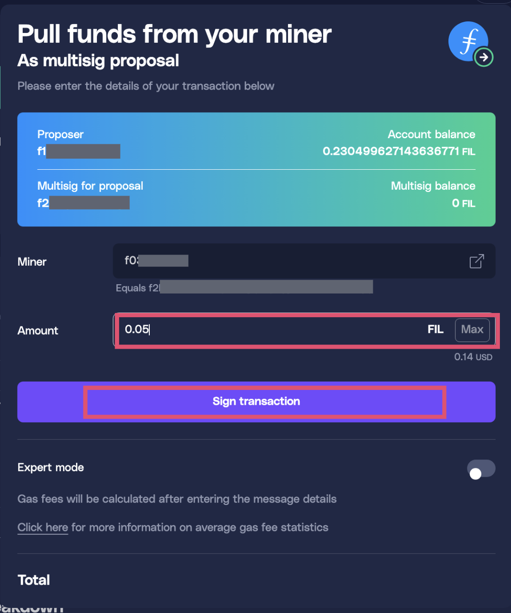
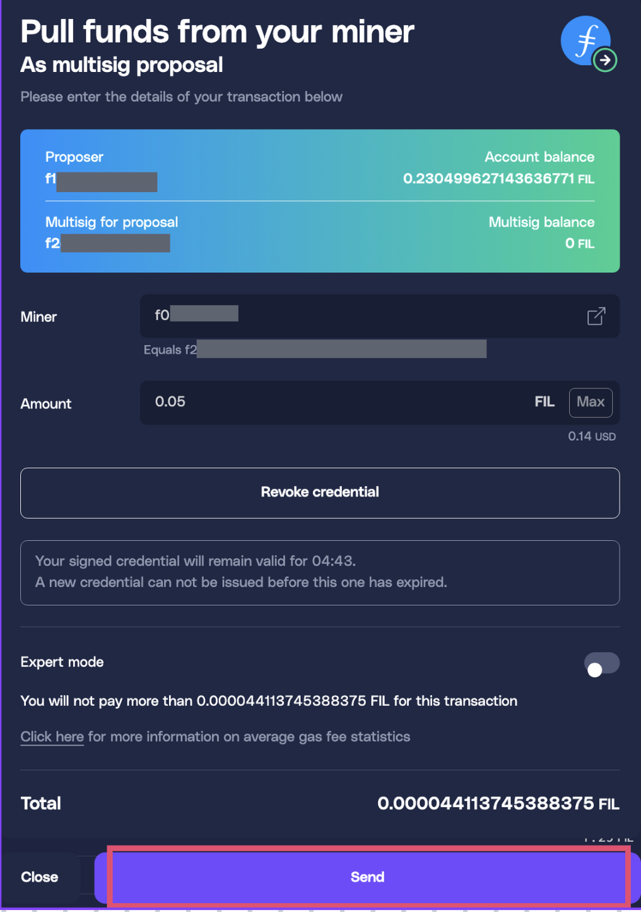
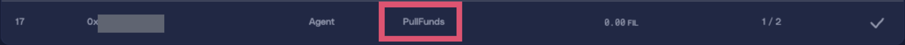
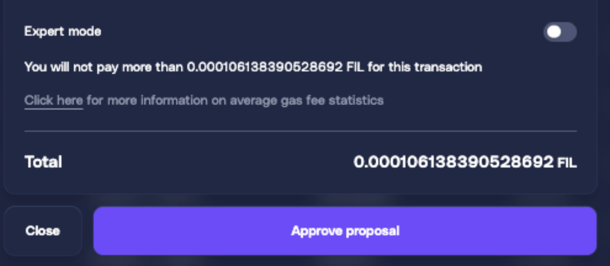

# GLIF Agent Website Tutorial Part 5 — Moving FIL between Miner and Agent

_If you don't understand the basics of GLIF Agents, Agent owners, or how to create your Agent on the GLIF website, we suggest starting with_[_Part 1_ ](glif-agent-website-tutorial-part-1-preparation-setup.md)_and_[ _Part 2_ ](glif-agent-website-tutorial-part-2-create-your-agent.md)_of this tutorial series. You can find all the tutorials about using Agents on the **GLIF website** on this_ [_page_](./)_. You can find the instructions about the Agent's command on the **GLIF Command Line Interface** on this_ [_page_](https://github.com/glifio/glif?tab=readme-ov-file#agents---get-started-borrowing)_._

***

## Before You Begin

In the previous parts of this tutorial series, you have created or completed the following:

1. Your Agent Owner multisig wallet ([Part 1](glif-agent-website-tutorial-part-1-preparation-setup.md) & [Part 2](glif-agent-website-tutorial-part-2-create-your-agent.md))
2. Your Agent smart contract ([Part 1](glif-agent-website-tutorial-part-1-preparation-setup.md) & [Part 2](glif-agent-website-tutorial-part-2-create-your-agent.md))
3. Adding your miner to the Agent ([Part 3](glif-agent-website-tutorial-part-3-add-your-miner.md))
4. Borrowing FIL from GLIF ([Part 4](glif-agent-website-tutorial-part-4-borrow.md))

Once the FIL available on your Agent, the next step is to [push](glif-agent-website-tutorial-part-5-moving-fil-between-miner-and-agent.md#push-funds-to-miner-from-your-agent) and [pull](glif-agent-website-tutorial-part-5-moving-fil-between-miner-and-agent.md#pull-funds-from-miner-to-your-agent) funds from Agent to a Miner. In this part of the tutorial, we will guide you through this process using the GLIF website interface.

***

## Push Funds to Miner from Your Agent

To push funds from your Agent to a Miner owned by your Agent for use as pledge collateral on the Filecoin network, follow these steps.

### Step 1: Initiate Push Funds to Miner

1. Navigate to the “**Miners**” section on your Agent page.
2. Click the downward arrow next to the miner you want to fund.

3. In the “**Push Funds to your Miner**” multisig proposal interface, enter the amount to send to your miner.
4. Click “**Sign Transaction**”.

> [!WARNING]
> Credentials are valid for only 5 minutes. If you see the error “_AgentPolice: Invalid Credential_”, it means the credentials have expired, so please start over.

5. Click “**Send**” and approve the transaction in your wallet.

6. Wait for the transaction to complete. A “**Push Funds**” proposal will appear in the “**Agent Owner Proposals**” section.

### Step 2: Approve the Proposal

1. Connect to another approver wallet from your Agent's owner multisig wallet.
2. Navigate to the “**Agent Owner Proposals**” section and find the “Push Funds” proposal.
3. Click “**Approve Proposal**”.

4. Confirm the transaction in your wallet.
5. Wait for the transaction to complete (1–2 minutes). The available balance will be updated: the Agent's available balance will decrease, and the Miner's balance will increase.

## Pull Funds from Miner to Your Agent

To pull funds from your Miner to your Agent for withdrawing rewards or making a payment, follow these steps.

### Step 1: Initiate Pull Funds from Miner

1. Navigate to the “**Miners**” section on your Agent page.
2. Click the upward arrow next to the miner you want to pull funds from.

3. In the “**Pull Funds from your Miner**” multisig proposal interface, enter the amount to withdraw. Amount cannot exceed the miner's available balance.
4. Click “**Sign Transaction**”.

> [!WARNING]
> Credentials are valid for only 5 minutes. If you see the error “_AgentPolice: Invalid Credential_”, it means the credentials have expired, so please start over.

5. Click “**Send**” and approve the transaction in your wallet.

6. Wait for the transaction to complete. A “**Pull Funds**” proposal will appear in the “**Agent Owner Proposals**” section.

### Step 2: Approve the Proposal

1. Connect to another approver wallet from your Agent's owner multisig wallet.
2. Navigate to the “**Agent Owner Proposals**” section and find the “**Pull Funds**” proposal.
3. Click “**Approve Proposal”.**

4. Confirm the transaction in your wallet.
5. Wait for the transaction to complete (1–2 minutes). The available balance will be updated: the Agent's available balance will increase, and the Miner's balance will decrease.

***

## Congratulations!

You've successfully moved FIL between Miner and Agent!

## **Next Steps:**

In [Part 6](glif-agent-website-tutorial-part-6-withdraw-rewards-cash-advance.md) of this tutorial, we will show you how to withdraw funds from the Agent.

## Join our community!

Feel free to join our [Discord](https://discord.gg/5qsJjsP3Re) and [Telegram](https://t.me/+iFJuXAMp-Xg5NGIx) or follow us on[ X](https://twitter.com/glifio) for the latest updates.

If you encounter any difficulties, please feel free to contact us through our [Discord support ticket](https://discord.gg/5qsJjsP3Re).
