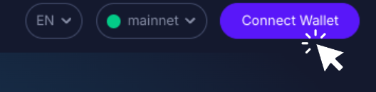
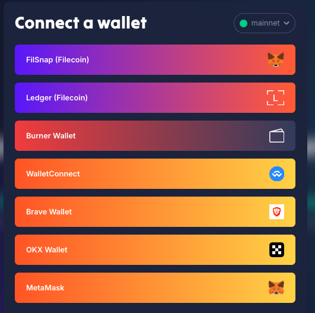
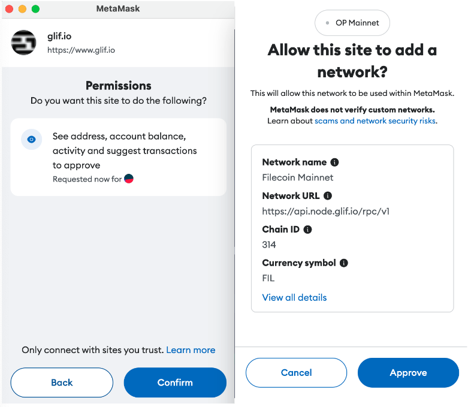
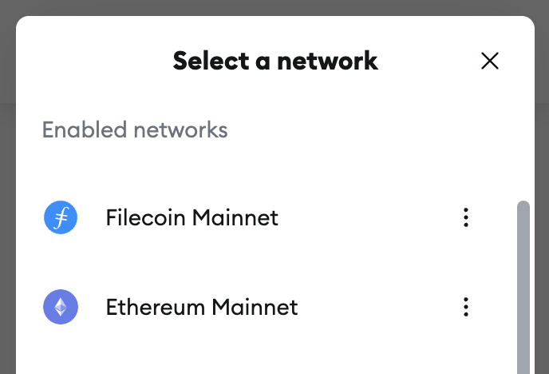

# How to connect your wallet to Filecoin Mainnet

To deposit FIL into GLIF, you first need to choose a wallet that supports FIL and connect to Filecoin Mainnet. This tutorial will guide you through the process of connecting your wallet to the Filecoin Mainnet so that you can interact with GLIF.

## Step 1: Prepare a wallet with FIL on it

GLIF is compatible with [most EVM wallets](https://filecointldr.io/how-to-buy-filecoin) as well as the [FilSnap (MetaMask snap](how-to-obtain-a-filsnap-wallet-as-the-intermediary-wallet.md)[)](how-to-obtain-a-filsnap-wallet-as-the-intermediary-wallet.md) and the[ Ledger in Filecoin App](how-to-obtain-a-ledger-wallet-as-the-intermediary-wallet.md). You can find more information about Filecoin wallets [here](https://filecointldr.io/how-to-buy-filecoin). Make sure to do your own research (DYOR) to select the wallet.

In this tutorial we will use MetaMask, but you can find a similar tutorial using Ledger [here](../using-the-pool/how-to-deposit-filecoin-from-a-hardware-wallet-with-glif.md).

> [!IMPORTANT]
> No matter which wallet you use, always make sure to back up your secret recovery phrase, store it securely, and never share it with anyone. No one from the GLIF team will ever ask you for private keys or seed phrases.

## Step 2: Connect your wallet to GLIF

1. Visit the [GLIF website](https://www.glif.io) and click on “**Connect Wallet**” in the top right corner.

2. Select the wallet you wish to connect.

## Step 3: Add the Filecoin network to your wallet (chrome extensions only)

1. After choosing a chrome extension wallet (e.g. MetaMask) from the list of wallets, you may see a prompt appear in your wallet asking you to add the Filecoin network.

> [!TIP]
> Using Ledger? Check out our Ledger tutorial [here](../using-the-pool/how-to-deposit-filecoin-from-a-hardware-wallet-with-glif.md).

2. Click “**Confirm**”, then click “**Approve**” in MetaMask**.**

3. If the prompt to change the network does not pop up, you can follow the steps on[ this website ](https://docs.filecoin.io/basics/assets/metamask-setup)from Filecoin Docs.

This step connects your MetaMask wallet to the Filecoin network. You can switch between networks anytime from within your wallet.

## Step 4: Choose Filecoin Mainnet

The Filecoin Mainnet should now appear in your network options. Select “**Filecoin Mainnet**”.

## Conclusion

Finally, your wallet is connected to the Filecoin Mainnet. You can now start depositing FIL to use GLIF and earn rewards!

## Join our community!

Feel free to join our [Discord](https://discord.gg/5qsJjsP3Re) and [Telegram](https://t.me/+iFJuXAMp-Xg5NGIx) or follow us on[ X](https://twitter.com/glifio) for the latest updates.

If you encounter any difficulties, please feel free to contact us through our [Discord support ticket](https://discord.gg/5qsJjsP3Re).
