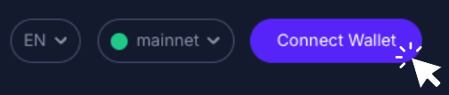
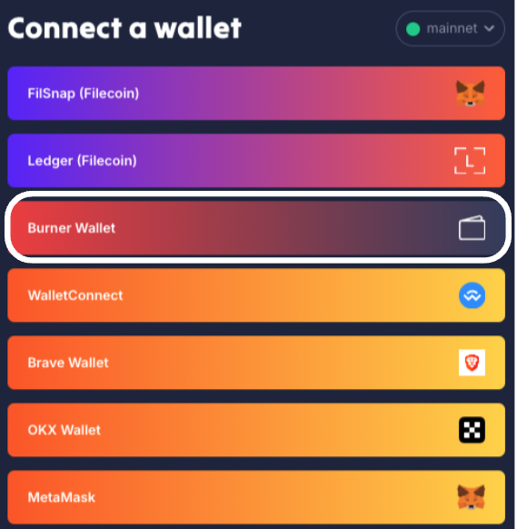
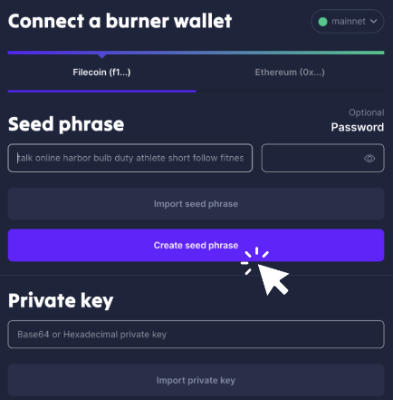
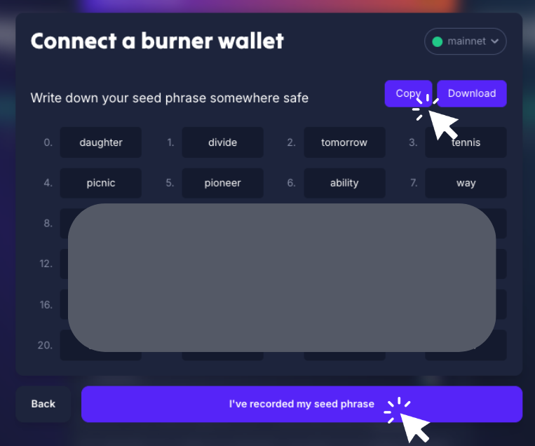
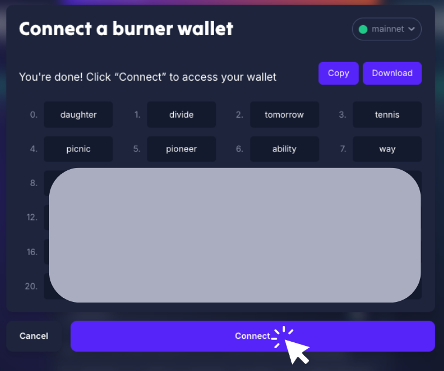
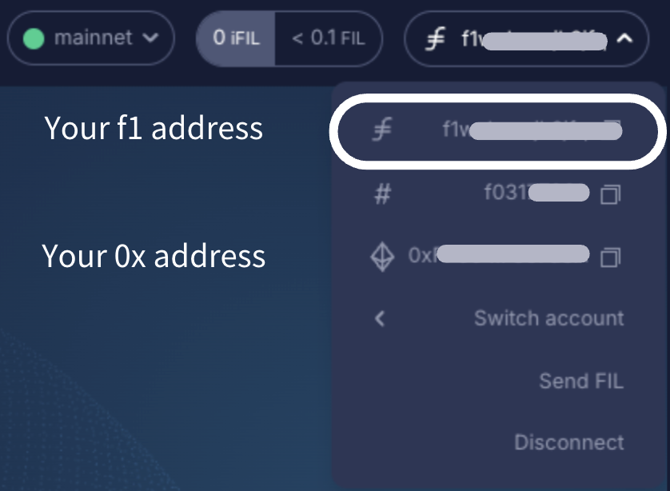
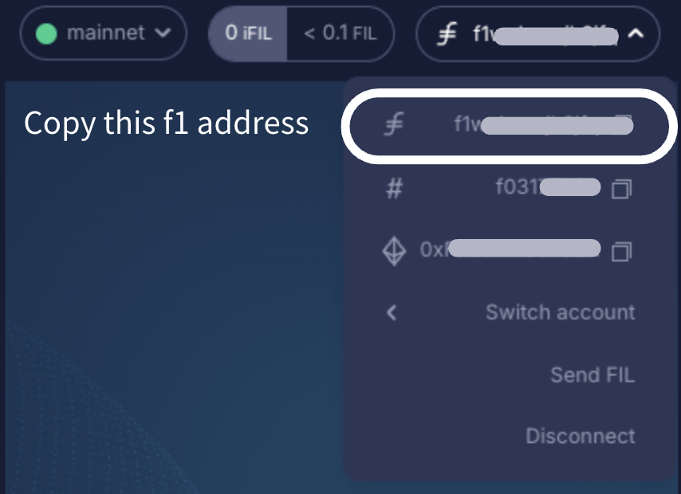

# How to obtain a burner wallet as the intermediary wallet

The Filecoin ecosystem includes various types of addresses, such as `f0`, `f1`, `f2`, `f3`, and `f410` (or `0x`). Some wallets, like Metamask, only support `0x` addresses, while certain exchanges recognize only `f1` addresses. Due to these differences, some wallets or exchanges may not recognize specific address types as valid Filecoin destinations. In such cases, an intermediary wallet may be needed to act as a bridge.

This guide explains how to create a **burner wallet** as an intermediary wallet with an `f1` address, which you can use as a middle point to transfer your FIL from your main wallet to its final destination. Other than a burner wallet, you can also choose an intermediary wallet to obtain a [Ledger wallet](how-to-obtain-a-ledger-wallet-as-the-intermediary-wallet.md) or [FilSnap wallet](how-to-obtain-a-filsnap-wallet-as-the-intermediary-wallet.md).

## Step-by-step guide

To obtain a Burner wallet, you will need to:

1. Visit the GLIF website and click “**Connect Wallet**” in the top right corner.

2. Select “**Burner Wallet**” from the options.

3. Choose “**Filecoin (f1...)**” as the address type. Click “**Create Seed Phrase**” to generate a new 24-word seed phrase.

4. Click “**Copy**” and save the seed phrase in a safe place, as it will be used to regain access to the burner wallet if you get disconnected. Then, click “**I've recorded my seed phrase.**”

5. Then, you are required to type in several words from your seed phrase to double-check your record of the seed phrase. Finally, click “**Connect.**”

6. After connecting, you will see your burner wallet's f1 and 0x addresses.

7. Copy the burner wallet's f1 address for later use.

> [!TIP]
> It is highly recommended to **disconnect and reconnect** your newly created burner wallet before transferring any FIL to ensure you understand how to access it in the future, minimizing the risk of losing access to your funds.

## Conclusion

Congrats! You have obtained a burner wallet as an intermediary wallet with an `f1` address.

Remember to keep your seed phrase safe and private, and always perform a test transaction before sending a large amount!

## Join our community!

Feel free to join our [Discord](https://discord.gg/5qsJjsP3Re) and [Telegram](https://t.me/+iFJuXAMp-Xg5NGIx) or follow us on[ X](https://twitter.com/glifio) for the latest updates.

If you encounter any difficulties, please feel free to contact us through our [Discord support ticket](https://discord.gg/5qsJjsP3Re).
