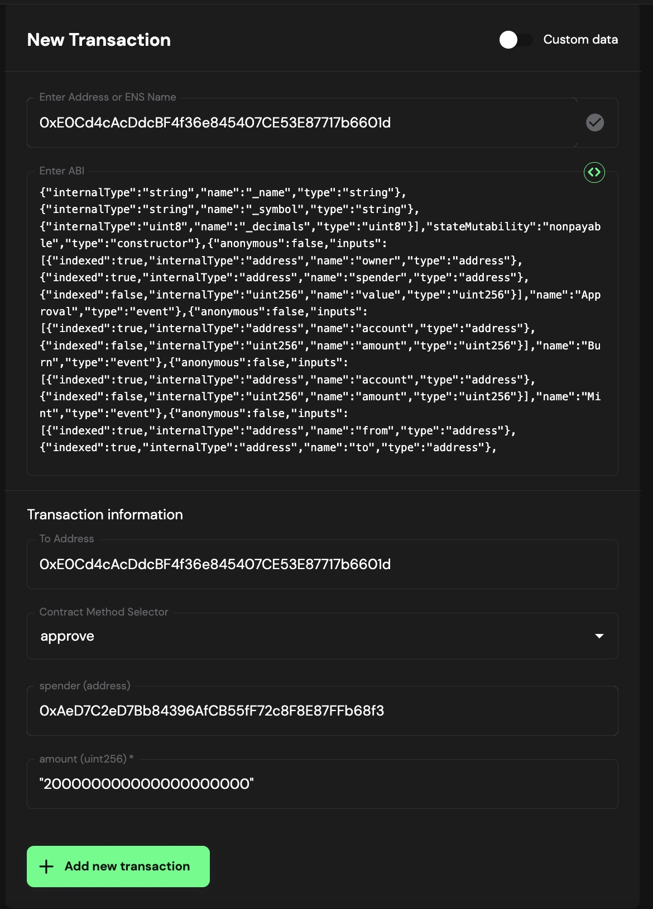
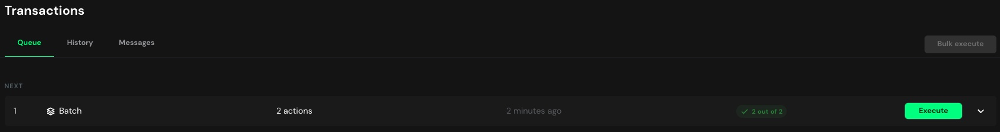

# Staking ICNT from a Safe multisig wallet

In this tutorial, you will stake ICNT tokens from a [**Safe multisig wallet**](https://app.safe.global/) into the GLIF ICNT staking pool to start earning rewards with GLIF.

You will use the [**Safe Transaction Builder**](https://help.safe.global/en/articles/234052-transaction-builder) to create a **batch transaction** that performs two actions in a single on-chain operation:

1. Approve the GLIF pool to spend your Safe's ICNT tokens
2. Deposit your ICNT tokens from your Safe into the GLIF pool

### Contents

In this tutorial, you will follow these steps:

* [Step 1: Connect to a signer wallet and open the Transaction Builder](staking-icnt-from-a-safe-multisig-wallet.md#step-1-connect-to-a-signer-wallet-and-open-the-transaction-builder)
* [Step 2: Create the First Transaction — `approve`](staking-icnt-from-a-safe-multisig-wallet.md#step-2-create-the-first-transaction-approve)&#x20;
* [Step 3: Create the Second Transaction — `deposit`](staking-icnt-from-a-safe-multisig-wallet.md#step-3-create-the-second-transaction-deposit)&#x20;
* [Step 4: Review and Create Batch](staking-icnt-from-a-safe-multisig-wallet.md#step-4-review-and-create-batch)
* [Step 5: Confirm Transaction](staking-icnt-from-a-safe-multisig-wallet.md#step-5-confirm-transaction)
* [Step 6: Sign](staking-icnt-from-a-safe-multisig-wallet.md#step-6-sign)
* [Step 7: Get Additional Signatures](staking-icnt-from-a-safe-multisig-wallet.md#step-7-get-additional-signatures)
* [Step 8: Execute the Transaction](staking-icnt-from-a-safe-multisig-wallet.md#step-8-execute-the-transaction)

***

### Step 1: Connect to a signer wallet and open the Transaction Builder

1. Connect a wallet that is a signer on your Safe multisig wallet.
2. From your Safe multisig interface, click "**New transaction**". Then click "**Transaction Builder".**

<figure><figcaption></figcaption></figure>

3. Open the Transaction Builder App in Safe.

<figure><figcaption></figcaption></figure>

***

### Step 2: Create the First Transaction — `approve`

This step gives the GLIF staking pool permission to spend your ICNT tokens.

1. In the **"New Transaction"** section, paste the following ICNT token contract address into the **"Address or ENS Name"** field:


**ICNT Token Contract (Base):** `0xE0Cd4cAcDdcBF4f36e845407CE53E87717b6601d`


2. The ABI should load automatically, and the **Contract Method Selector** will show `approve`.
3. In the **spender (address)** field, enter the following ICNT staking pool address:


**ICNT Staking Pool Address:** `0xAeD7C2eD7Bb84396AfCB55fF72c8F8E87FFb68f3`


4. In the **amount (uint256)** field, enter the number of ICNT tokens you want to stake **in wei**. You can convert your token amount to wei using [this tool](https://etherscan.io/unitconverter).&#x20;


Please always start with a small amount as a test transaction.


5. Click **“Add new transaction”**.

<figure><figcaption></figcaption></figure>

6. You should now see a **Transactions Batch** summary with the `approve` action listed on the right.

<figure><figcaption></figcaption></figure>

***

### Step 3: Create the Second Transaction — `deposit`

Next, you will create a transaction to deposit ICNT tokens into the GLIF staking pool.

1. In a new transaction, enter the following **staking pool contract address** into the **"Address or ENS Name"** field:


**ICNT Staking Pool Address:**  `0xAeD7C2eD7Bb84396AfCB55fF72c8F8E87FFb68f3`


2. The ABI will load automatically. If prompted, choose **"Use Implementation ABI"**, since this is a proxy contract.

<figure><figcaption></figcaption></figure>

3. From the **Contract Method Selector**, choose `deposit`.
4. Enter the same ICNT amount (in wei) in the **assets (uint256)** field.
5. In the **receiver (address)** field, enter your Safe wallet address, which will be the recipient of the stICNT.
6. Click **“Add new transaction”**.

<figure><figcaption></figcaption></figure>

***

### Step 4: Review and Create Batch

1. You should now see both transactions , `approve` and `deposit` , listed in your **Transactions Batch** summary.
2. Click **“Create Batch”**.

<figure><figcaption></figcaption></figure>

***

### Step 5: Confirm transaction

1. On the **Review and Confirm** screen, click **“Send Batch”**.

<figure><figcaption></figcaption></figure>

2. In the **Balance Change** section, confirm:

* &#x20;A decrease in ICNT tokens (sent from the Safe wallet)
* An increase in staked ICNT (stICNT) (received in the Safe wallet)

<figure><figcaption></figcaption></figure>

3. You can click '**Simulate**' to check whether there are any issues with this transaction.&#x20;

<figure><figcaption></figcaption></figure>

4. You should see "**Success**" after simulating it.

<figure><figcaption></figcaption></figure>

***

### Step 6: Sign

1. Click **“Continue”** to proceed to the **Review Details** screen.

<figure><figcaption></figcaption></figure>

2. When ready, click **“Sign”** to approve the transaction from your Safe wallet.

<figure><figcaption></figcaption></figure>

3. Confirm the transaction in your wallet.


You should always match the transaction details you see on the screen with those you are signing in your wallet. Please make sure you understand what you are signing.


4. The batch is now created, pending confirmation from other signers.

<figure><figcaption></figcaption></figure>

***

### Step 7: Get Additional Signatures

1. Connect with your other Safe signers.
2. Go to the **Transactions** tab.
3. Find the pending batch and click **“Confirm”**.

<figure><figcaption></figcaption></figure>

4. Each signer must review and confirm the transaction, just like in Step 6 with the first signer.

***

### Step 8: Execute the Transaction

1. Once all required signers have approved, navigate to **Transactions** and click **“Execute”**.

<figure><figcaption></figcaption></figure>

2. Confirm and review the transaction details.&#x20;


Please confirm that the wallet that executes your Safe proposal has enough gas fees on the Base chain.


<figure><figcaption></figcaption></figure>

3. The transaction will now be processed on-chain.
4. After confirmation, check your updated balances in the **Assets** tab. You should see both **ICNT** and **stICNT**.

<figure><figcaption></figcaption></figure>

***

## **Conclusion** 

By following this step-by-step guide, you can successfully deposit your ICNT from a Safe multisig wallet into the GLIF staking pool and start earning rewards! Remember to always double-check addresses and transaction details to ensure the accuracy and security of your funds.

## Join our community! 

Feel free to join our [Discord](https://discord.gg/5qsJjsP3Re) and [Telegram](https://t.me/+iFJuXAMp-Xg5NGIx) or follow us on[ X](https://twitter.com/glifio) for the latest updates.

If you encounter any difficulties, please feel free to contact us through our [Discord support ticket](https://discord.gg/5qsJjsP3Re).
